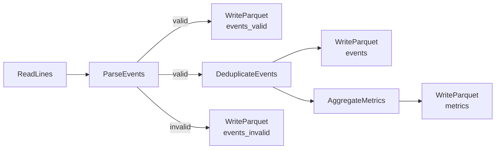

# Futurae Data Engineering Assignment

Event processing pipeline and API for ingesting, validating, aggregating,
and querying operational event data from multiple services.

## Setup

```bash
uv sync && source .venv/bin/activate
```

## Quick start

Run the pipeline, then start the API:

```bash
python run_pipeline.py
python app.py
```

## Project structure

```
futurae_assignment/
    config.py           # Pydantic settings (env-configurable)
    models.py           # Event, InvalidEvent, Metrics domain models
    db.py               # DuckDB client
    logging.py          # Logger factory
    pipeline/
        reader.py       # Reads JSONL lines with offsets
        parser.py       # Validates/cleans events, splits valid/invalid
        deduper.py      # Deduplicates by event_id (keeps latest)
        aggregator.py   # Computes per-service per-minute metrics
        writer.py       # Writes Parquet output
        pipeline.py     # Orchestrates the full pipeline
    api/
        routers/
            events.py   # GET /events, GET /events/{event_id}
            metrics.py  # GET /metrics, GET /metrics/aggregate
        models.py       # API response models
app.py                  # FastAPI entrypoint
run_pipeline.py         # Pipeline entrypoint
tests/                  # Pytest suite (37 tests)
```

## Part 1 -- Data ingestion & transformation

The pipeline is built with Apache Beam (`DirectRunner` locally).
It reads a JSONL file and produces four Parquet outputs:

- valid events
- invalid events
- deduplicated events
- aggregated metrics.

### Pipeline flow



### Validation and cleaning

Each JSON line is parsed through Pydantic validation. The model handles imperfect data with custom validators:

- **Timestamps**: accepts ISO 8601 (`2025-01-12T10:32:14Z`) and `dd/mm/yyyy hh:mm:ss` formats. All timestamps are normalized to UTC `datetime` objects.
- **Latency**: coerces string values like `"123ms"` to integers; empty strings become `None`.
- **Status codes**: validated to the 100-599 range; out-of-range values are rejected.
- **Service/event_type**: validated against known enums (`auth`, `catalog`, `checkout`, `payments`, `search`).

### What gets dropped and why

| Condition                           | Action                               | Reason                                                                                                                                                                                                                                                 |
| ----------------------------------- | ------------------------------------ | ------------------------------------------------------------------------------------------------------------------------------------------------------------------------------------------------------------------------------------------------------ |
| Unparseable JSON                    | Routed to `events_invalid`           | No fields can be extracted from a malformed line, so there is nothing to validate or aggregate. The raw line is preserved for debugging the upstream producer.                                                                                         |
| Missing `event_id` or `timestamp`   | Routed to `events_invalid`           | `event_id` is the deduplication key and `timestamp` determines event ordering and time-bucketed aggregation. Without either, the event cannot be placed correctly in the pipeline.                                                                     |
| Unknown `event_type`                | Routed to `events_invalid`           | The enum is the contract between producers and consumers. An unknown value likely indicates a bug in the producer or a schema version mismatch that should be surfaced, not silently accepted.                                                         |
| Unknown `service` value             | Routed to `events_invalid`           | Same rationale as `event_type` — metrics are grouped by service, so accepting unknown services would create unrecognized buckets in dashboards and alerts without anyone noticing the misconfiguration.                                                |
| Invalid `status_code` range         | Routed to `events_invalid`           | HTTP status codes are defined in the 100-599 range. A value outside this range cannot be a real status code, so the event is likely corrupted or produced by a buggy instrumentation.                                                                  |
| Duplicate `event_id`                | Deduplicated (latest kept)           | At-least-once delivery and upstream retries are expected in distributed systems. Keeping the latest occurrence ensures we have the most up-to-date version of the event while avoiding double-counting in metrics.                                     |
| Missing `service` (`None`)          | Kept as event, excluded from metrics | The event is otherwise valid and queryable. However, since metrics are bucketed by service, an event with no service cannot be placed in any bucket and is excluded from aggregation only.                                                             |
| Missing `user_id`                   | Routed to `events_invalid`           | In the input data, the vast majority of events include `user_id` — the 9 events missing it appear to be instrumentation gaps rather than legitimate service-to-service calls or anonymous requests. Treating it as required surfaces these gaps early. |
| Missing `latency_ms`                | Kept (nullable)                      | Assuming measurement error. Should be targeted through a data quality check.                                                                                                                                                                           |
| Unknown fields (e.g. `extra_field`) | Silently ignored                     | Keeps the pipeline forward-compatible: upstream services may add fields before the pipeline schema is updated. Rejecting unknown fields would cause spurious failures on deploy mismatches.                                                            |

Invalid events are never silently dropped -- they are written to `events_invalid` with the original raw line and all error messages for debugging.

### Aggregated metrics

Events are bucketed by `(service, date, hour, minute)` and reduced into:

- **request_count**: total events in the bucket
- **avg_latency_ms**: mean latency (treating `None` as 0)
- **error_rate**: fraction of events with a non-null `status_code` outside 200-299 (events with `None` status are not counted as errors)

The aggregation uses a custom `CombineFn` with an accumulator pattern, making it compatible with Beam's distributed execution and windowed streaming.

## Part 2 -- Storage & modeling (design)

### Where data goes

**Raw events -> BigQuery** (append-only, ingestion-time partitioned, clustered by `event_ts`)

Columnar storage suits the ad-hoc analytical queries that analytics and ML teams run. Ingestion-time partitioning means data always lands in the current partition regardless of `event_ts`, avoiding scattered writes from late-arriving events. Clustering by `event_ts` keeps time-range queries fast within each partition.

**Aggregated metrics -> Bigtable**

Metrics are keyed by `(service, date, hour, minute)` — a natural row key for Bigtable. Sub-millisecond point lookups serve dashboards and alerting, and the sorted key layout makes time-range scans for a given service sequential. BigQuery would add unnecessary latency for these simple lookups.

### Schema evolution

**BigQuery**: use `NULLABLE` columns with default values. Non-breaking changes (new optional fields) are added as nullable columns — existing queries and consumers are unaffected. For breaking changes (renames, type changes, field removals), tables follow semantic versioning: `events_v1`, `events_v2`, etc. Consumers reference a view (`events_latest`) that maps the current version's schema, giving teams time to migrate while the pipeline writes to the new table. Old versions are retained read-only until all consumers have moved over.

**Bigtable**: schema-less by nature. New metric columns can be added to the column family without migration. Readers that encounter missing columns treat them as absent (application-level default). For structural changes to the row key, write to a new table and backfill.

For both stores, the pipeline's Pydantic models act as a contract: changes to the model surface validation errors early in development rather than corrupting stored data.

## Part 3 -- Data API

FastAPI application serving the pipeline's Parquet output via DuckDB. DuckDB reads Parquet files directly with `read_parquet()`, so no separate data loading step is needed.

### Endpoints

| Method | Path                 | Query params                                  | Description                                   |
| ------ | -------------------- | --------------------------------------------- | --------------------------------------------- |
| GET    | `/events`            | `service`, `event_type`, `start_ts`, `end_ts` | List events with optional filters             |
| GET    | `/events/{event_id}` | --                                            | Get a single event                            |
| GET    | `/metrics`           | `service`, `start_ts`, `end_ts`               | List pre-aggregated metrics                   |
| GET    | `/metrics/aggregate` | `service`, `start_ts`, `end_ts`               | Compute aggregates on the fly from raw events |

### Design decisions

- **DuckDB over SQLite/Pandas**: DuckDB reads Parquet natively with zero-copy, supports parameterized SQL, and handles analytical queries efficiently. No ETL step needed between the pipeline output and the API.
- **Dependency injection**: `Config`, `Database`, and all settings flow through FastAPI's `Depends` chain. Routers never import global state, making them testable with config overrides.
- **Typed responses**: Pydantic response models validate output shape at the boundary. Clients get consistent JSON structures.

### Tests

37 tests covering models, pipeline transforms, database client, and API endpoints:

```bash
python -m pytest
```

Tests use real implementations (actual Beam pipelines, real DuckDB connections, FastAPI TestClient) rather than mocks.

## Part 4 -- Code quality & reliability

### What to monitor in production

- **Pipeline health**: Dataflow job metrics — elements processed vs dropped, parse error rate, system lag. A spike in invalid events signals upstream schema changes or a misbehaving Kafka producer.
- **Data freshness**: watermark lag in Dataflow and the delta between the latest `event_ts` in BigQuery/Bigtable and wall clock. Growing lag means the pipeline is falling behind Kafka throughput or a Dataflow worker is stuck.
- **Kafka consumer lag**: per-partition lag on the consumer group. Sustained lag indicates the pipeline can't keep up and needs more Dataflow workers or the Kafka topic needs repartitioning.
- **BigQuery streaming insert errors**: failed inserts, quota exhaustion, and row-level errors. These are silent data loss if not monitored.
- **Bigtable hotspotting**: monitor per-node request distribution. If the row key design causes uneven load (e.g., one service dominates traffic), reads and writes to that tablet slow down.
- **API latency and error rate**: p50/p95/p99 response times per endpoint against BigQuery and Bigtable.

### What breaks at scale

- **Kafka partition skew**: if events are not evenly distributed across Kafka partitions (e.g., one service produces 90% of traffic), some Dataflow workers will be overloaded while others idle. Solution: partition Kafka by `event_id` hash rather than `service` to spread load.
- **Deduplication state**: the `Latest.PerKey` combiner holds state per `event_id`. At millions of unique IDs, Dataflow spills state to persistent storage (Shuffle), but very high cardinality still increases checkpoint size and recovery time. A time-windowed dedup (e.g., 1-hour windows) bounds state while still catching most retries.
- **BigQuery streaming buffer cost**: high-throughput streaming inserts are more expensive than batch loads. If latency requirements allow a few minutes of delay, switching to micro-batch loads (e.g., every 1-2 minutes via Dataflow's BigQuery batch sink) reduces cost significantly.
- **Bigtable row size**: if the metrics schema grows (more aggregation dimensions), rows can exceed the recommended 10MB limit. Solution: split wide rows into separate column families or narrow the time granularity.

### What I would improve next

1. **Dead-letter queue**: instead of writing invalid events to Parquet, publish them to a separate Kafka topic. This enables automated retries after pipeline fixes and integrates with alerting (consumers on the DLQ topic trigger PagerDuty/Slack).
2. **Schema registry**: enforce a Protobuf schema on the Kafka topic using Pub/Sub schemas or a GCP-hosted schema registry. This catches schema mismatches at the producer before bad data enters the pipeline, shifting validation left.
